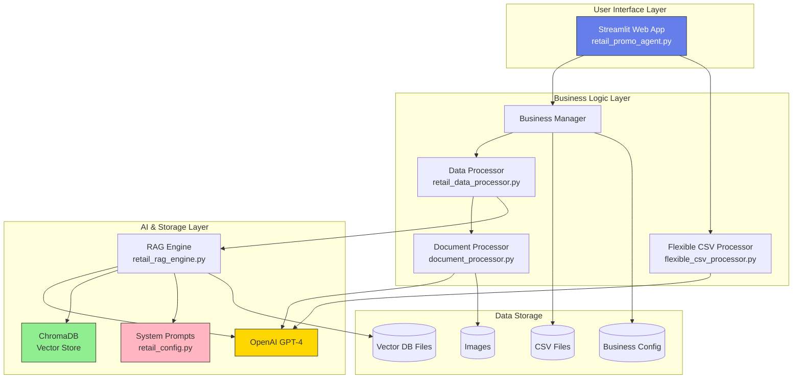
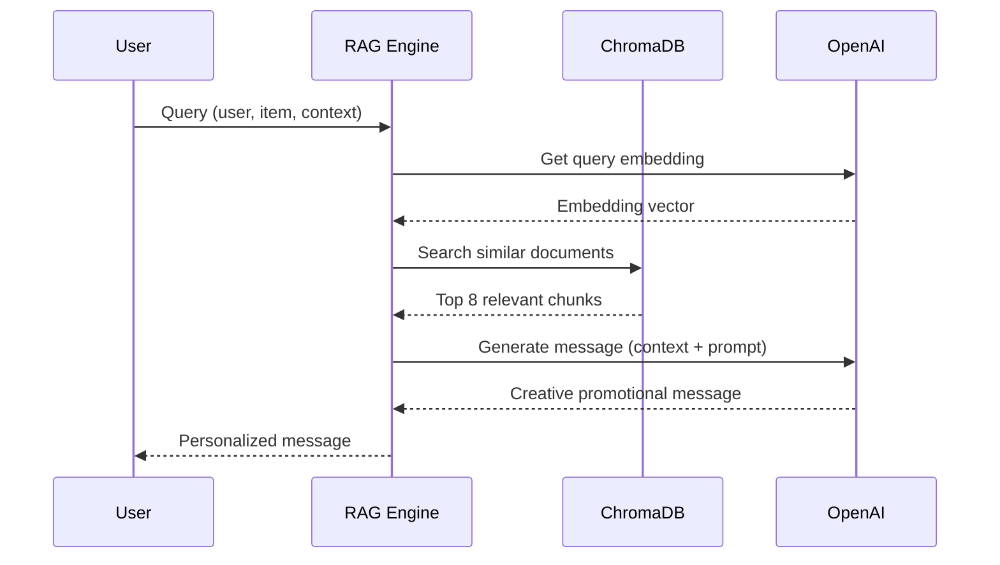
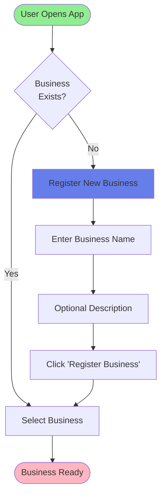
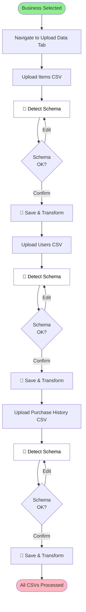
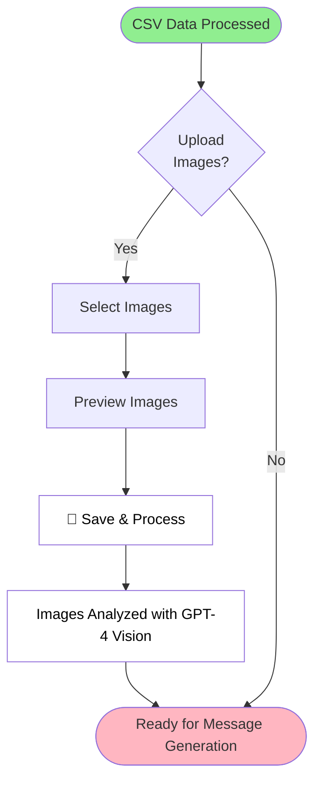

# 🛒 Indian Retail Promotional Message AI Agent - Complete System Documentation

## 📋 Table of Contents
1. [System Overview](#system-overview)
2. [Architecture & Components](#architecture--components)
3. [File-by-File Analysis](#file-by-file-analysis)
4. [User Journey & Step-by-Step Guide](#user-journey--step-by-step-guide)
5. [Advanced Features](#advanced-features)
6. [Data Flow Diagrams](#data-flow-diagrams)

---

## 🎯 System Overview

This is an **AI-powered promotional message generation system** designed specifically for Indian retail businesses. It creates personalized, culturally-relevant marketing messages by analyzing customer data, product catalogs, and purchase history.

### Key Capabilities
- ✅ **Multi-Business Support**: Manage multiple retail businesses independently
- ✅ **Flexible CSV Processing**: Accepts any CSV format with AI-powered schema detection
- ✅ **Personalized Messaging**: Generates creative promotional messages in multiple tones (Meme, Tapori, Emotional, etc.)
- ✅ **Broadcast Campaigns**: Create single messages for filtered audience segments
- ✅ **Image Analysis**: Processes promotional images using AI vision
- ✅ **Vector Database**: Fast semantic search for contextual message generation
- ✅ **Dynamic Prompts**: Edit AI behavior on-the-fly for each business

---

## 🏗️ Architecture & Components



---

## 📁 File-by-File Analysis

### Core Application Files

#### 1. **retail_promo_agent.py** (Main Application)
**Role**: Primary Streamlit application orchestrating the entire system

**Key Components**:
- `RetailBusinessManager`: Manages multiple retail businesses
  - Creates business directories
  - Stores business configurations
  - Manages CSV file paths
  - Handles business deletion

**Functions**:
```python
- register_business(name, description) → Creates new business
- save_csv_file(business_id, type, file) → Stores uploaded CSV
- get_business_list() → Returns all registered businesses
- delete_business(business_id) → Removes business and data
```

**UI Tabs**:
1. **💬 Generate Messages**: Individual personalized messages
2. **📢 Broadcast Messages**: Single message for all users
3. **📤 Upload Data**: CSV + Image uploads with AI schema detection
4. **📊 View Data**: Data exploration and export
5. **⚙️ Settings**: System prompts and configuration

---

#### 2. **flexible_csv_processor.py** (NEW - AI Schema Detection)
**Role**: Handles CSVs in ANY format using GPT-4 for intelligent column mapping

**Key Features**:
```python
class FlexibleCSVProcessor:
    EXPECTED_SCHEMAS = {
        'items': [15 fields],
        'users': [16 fields],
        'purchase_history': [9 fields]
    }
    
    CRITICAL_FIELDS = {
        'items': ['item_id', 'item_name', 'price'],
        'users': ['user_id', 'name'],
        'purchase_history': ['user_id', 'item_id']
    }
```

**Methods**:

1. **detect_csv_schema(df, csv_type)**
   - Analyzes user's CSV columns
   - Uses GPT-4 to map columns to expected schema
   - Returns confidence scores for each mapping
   - Identifies missing fields

2. **transform_dataframe(df, mapping, missing_fields, csv_type)**
   - Applies column mappings
   - Generates synthetic data for missing fields
   - Preserves unmapped columns with `_original_` prefix

3. **generate_missing_data(df, mapping, missing_fields, csv_type)**
   - Auto-generates IDs (e.g., ITEM0001)
   - Infers dates, numeric defaults
   - Uses AI for complex fields (descriptions, categories)

4. **auto_convert_types(df, csv_type)**
   - Converts numeric columns (price, age, quantity)
   - Parses date columns
   - Handles errors gracefully

**Example AI Prompt**:
```
Analyze this CSV and map columns to expected schema.

CSV Type: items
User's Columns: ['product_name', 'cost', 'category']
Sample Data: [{...}]

Expected Fields: ['item_id', 'item_name', 'price', ...]

Return JSON with mappings and confidence scores.
```

---

#### 3. **retail_data_processor.py** (Data Processing)
**Role**: Converts CSV data into text chunks for vector database with flexible column support

**Key Methods**:

1. **process_retail_data(items_df, users_df, history_df)**
   - Main orchestrator
   - Processes all 3 CSV types
   - Creates aggregate insights
   - Returns list of document chunks

2. **_process_items(items_df)** - Creates item chunks
   ```python
   def safe_get(row, col, default='N/A'):
       return row.get(col, default) if col in df.columns else default
   
   # Creates text like:
   "ITEM: Premium Basmati Rice (I001)
   Category: Groceries - Staples
   Pricing: ₹450 (18% OFF)
   ..."
   ```

3. **_process_users(users_df)** - Creates customer profiles
   ```python
   "CUSTOMER PROFILE: Rahul Sharma (U001)
   Demographics: 28 years, Male, Delhi
   Shopping Behavior: 15 purchases
   Favorite Categories: Electronics, Fashion
   ..."
   ```

4. **_process_purchase_history()** - Links purchases to customers and items

5. **process_business_images(business_id, image_files)** - Uses DocumentProcessor for image analysis

**Chunk Structure**:
```python
{
    "text": "Detailed description...",
    "metadata": {
        "type": "item"|"user"|"purchase"|"insight"|"image",
        "item_id": "I001",
        "category": "Groceries",
        ...
    }
}
```

---

#### 4. **retail_rag_engine.py** (Retrieval-Augmented Generation)
**Role**: Query engine that retrieves relevant context and generates messages

**Architecture**:


**Key Methods**:

1. **add_documents(chunks)**
   - Generates embeddings via OpenAI
   - Stores in ChromaDB with metadata
   - Maintains document IDs

2. **query(question, top_k=8)**
   - Embeds query
   - Retrieves top-k similar chunks
   - Checks guardrails
   - Generates response via GPT-4

3. **_generate_promotional_message(question, context)**
   - Uses business-specific system prompts
   - Temperature: 0.8 for creativity
   - Max tokens: 500

---

#### 5. **retail_config.py** (Dynamic Prompt Management)
**Role**: Manages system prompts with business-specific overrides and hot-reload capability

**Features**:
- **Caching**: In-memory prompt cache per business
- **File Monitoring**: Detects file changes and auto-reloads
- **Fallback**: Uses defaults if business file missing
- **Guardrails**: Pattern matching for prohibited content

**Prompt Structure**:
```markdown
### Full Prompt
```
You are an expert Indian Retail Promotional Message Creator...
- Tone Variations: Meme, Tapori, Emotional, Urgent, Friendly, Poetic
- Personalization: Name, age, location, history
- Cultural: Festivals, seasons, regional preferences
```

### Guardrail Response
```
I cannot assist with spam, fraud, etc.
```

### Prohibited Patterns
```
spam, scam, fake, fraud
```
```

**Key Methods**:
- `get_system_prompt(business_id)` → Returns main prompt
- `reload_prompts(business_id)` → Force reload from file
- `check_guardrails(query, business_id)` → Validate query
- `create_business_prompts_file()` → Copy default for new business

---

#### 6. **document_processor.py** (Image/Document Processing)
**Role**: Processes images and documents using OCR and GPT-4 Vision

**Capabilities**:
- **Image Understanding**: Describes images using GPT-4 Vision
- **Text Extraction**: OCR from images
- **PDF Processing**: Extracts text from PDFs
- **DOCX Processing**: Handles Word documents

**Method Flow**:
```python
process_document(file_path):
    if image:
        description = gpt4_vision.describe(image)
        ocr_text = extract_text(image)
        return chunks with both
    elif pdf:
        text = extract_pdf_text()
        return text chunks
```

---

### Configuration Files

#### 7. **.env**
```ini
OPENAI_API_KEY=sk-...
```

#### 8. **retail_requirements.txt**
```
streamlit
pandas
openai
chromadb
python-dotenv
Pillow
pytesseract
pypdf2
python-docx
```

#### 9. **RETAIL_SYSTEM_PROMPTS.md**
Default system prompts template used for new businesses

---

### Storage Structure

#### 10. **retail_businesses/** Directory
```
retail_businesses/
├── businesses_config.json  # Master business registry
└── [business_id]/
    ├── [business_id]_items.csv
    ├── [business_id]_users.csv
    ├── [business_id]_purchase_history.csv
    └── [business_id]_prompts.md
```

#### 11. **retail_vector_dbs/** Directory
```
retail_vector_dbs/
└── [business_id]/
    ├── chroma.sqlite3
    └── [uuid]/  # Vector embeddings
        ├── data_level0.bin
        ├── header.bin
        └── link_lists.bin
```

---

## 🚀 User Journey & Step-by-Step Guide
### Complete Workflow Diagram - Phase 1: Business Setup



### Complete Workflow Diagram - Phase 2: CSV Data Upload with AI Detection



### Complete Workflow Diagram - Phase 3: Image Upload & Ready State



---

### Detailed Step-by-Step Guide

### Phase 1: Business Registration

#### Step 1.1: Register a Business
1. **Access**: Open sidebar → "➕ Register New Business"
2. **Input**: 
   - Business Name: e.g., "Z-Mart"
   - Description (optional): "Indian grocery chain"
3. **Action**: Click "Register Business"
4. **Result**: 
   - Creates `retail_businesses/z_mart/` directory
   - Creates `retail_vector_dbs/z_mart/` directory
   - Adds entry to `businesses_config.json`
   - Initializes business-specific prompts file

#### Step 1.2: Select Business
1. **View**: Sidebar shows all registered businesses as cards
2. **Action**: Click "Select" button on desired business
3. **Status**: Button changes to "✓ Selected"
4. **Effect**: Main area updates to show business name and tabs

---

### Phase 2: Data Upload with AI Schema Detection

#### Step 2.1: Upload Items CSV (ANY FORMAT!)

1. **Navigate**: "📤 Upload Data" tab → "1️⃣ Items Data"

2. **Upload CSV**:
   - Click "Upload items CSV"
   - Select your CSV file
   - System shows: "✅ Loaded X rows, Y columns"

3. **AI Schema Detection**:
   ```
   Click "🤖 Detect Schema"
   ↓
   [AI Analyzing...]
   ↓
   Shows Detection Results:
   ```
   
   **Example Output**:
   ```
   ✅ Mapped: 8/10 columns
   ⚠️ Missing: 7 fields (will be auto-generated)
   🎯 High confidence mappings: 6
   
   Detected Mappings:
   item_name ← product_name (95%)
   price ← cost (90%)
   category ← type (85%)
   brand ← manufacturer (80%)
   ...
   
   Will Auto-Generate:
   ✨ item_id
   ✨ discount_percentage
   ✨ seasonal_relevance
   ✨ festival_relevance
   ...
   ```

4. **Review & Edit**:
   - Check confidence scores
   - Verify mappings make sense
   - Low confidence (<50%) may need manual review

5. **Transform & Save**:
   - Click "💾 Save & Transform Items CSV"
   - System:
