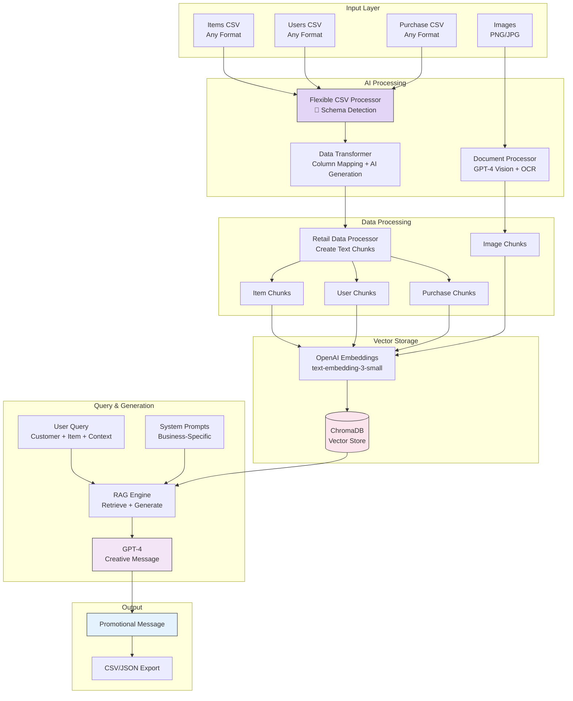
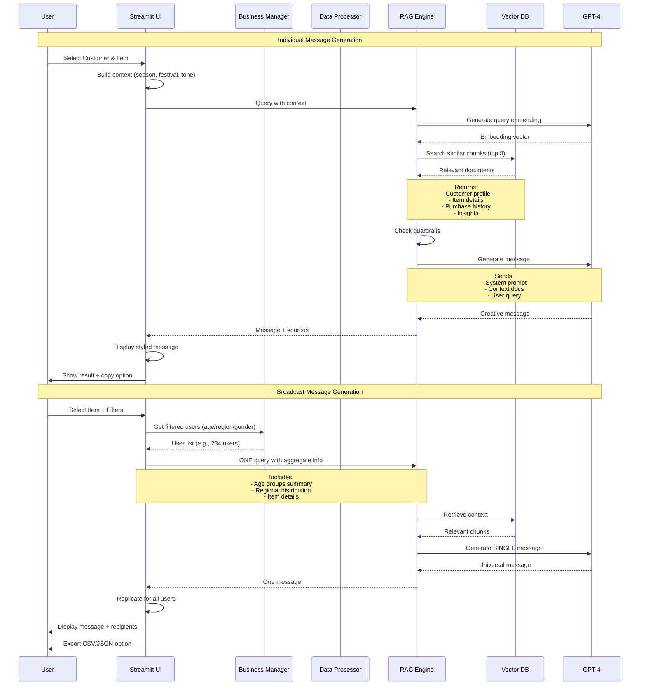
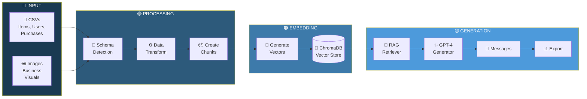
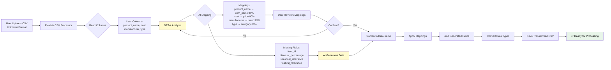
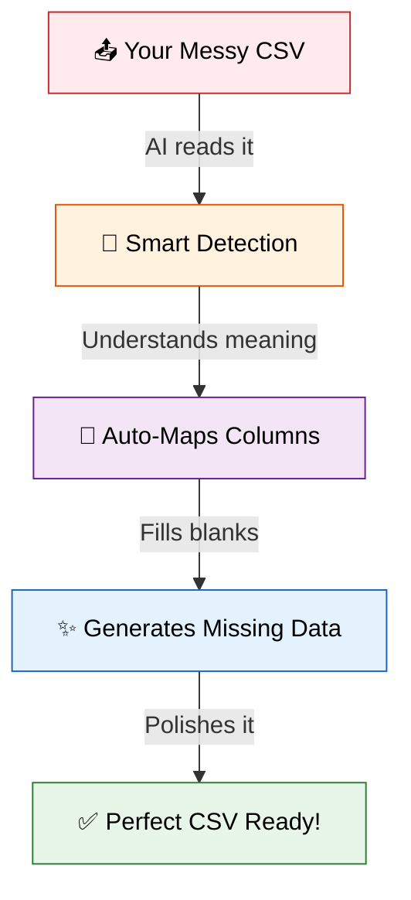
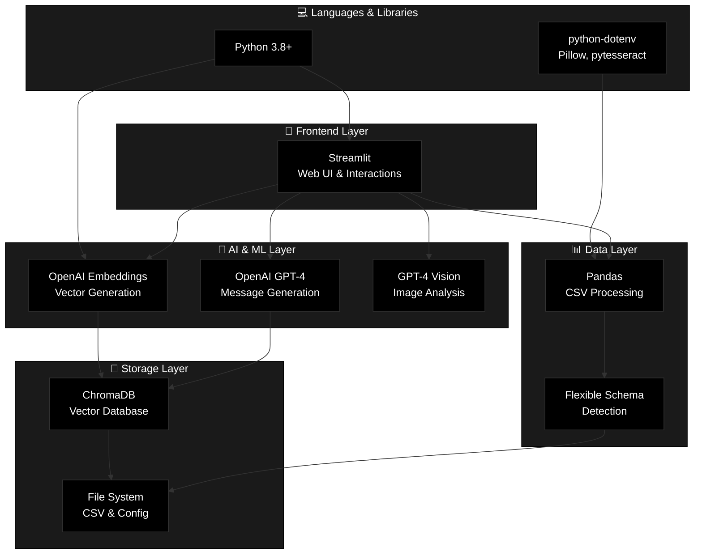

     - Applies column mappings
     - Generates missing data using AI
     - Converts data types
     - Saves transformed CSV
   - Status: "✅ Items CSV saved"

6. **Preview Transformed Data**:
   - Expand "Preview Data" to see final result
   - Verify data looks correct

#### Step 2.2: Upload Users CSV (Same Process)

1. Scroll to "2️⃣ Users Data"
2. Upload → Detect Schema → Review → Transform & Save
3. AI maps columns like:
   - `customer_name` → `name`
   - `phone_number` → `phone`
   - `user_age` → `age`
4. Auto-generates: `user_id`, `loyalty_points`, `total_purchases`, etc.

#### Step 2.3: Upload Purchase History CSV

1. Scroll to "3️⃣ Purchase History Data"
2. Same process: Upload → Detect → Transform → Save
3. Critical mappings:
   - Must link `user_id` and `item_id`
   - Maps date columns to `purchase_date`
   - Maps amount columns to `total_amount`

---

#### Step 2.4: Upload Images (Optional but Powerful!)

1. **Navigate**: Scroll to "🖼️ Business Images"

2. **Upload**:
   - Click "Upload business images"
   - Select PNG/JPG/JPEG files
   - Can select multiple images

3. **Preview**:
   - See thumbnails of all selected images
   - Review image names

4. **Process**:
   - Click "💾 Save & Process Images"
   - System uses GPT-4 Vision to:
     - Describe image content
     - Extract text (OCR)
     - Identify products/branding
   - Creates image chunks for vector DB

5. **Use Cases**:
   - Store banners/posters
   - Product images
   - Promotional flyers
   - AI can reference these in messages!

---

### Phase 3: Vector Database Loading

#### Step 3.1: Process All Data

1. **Status Check**:
   - System shows "✅ All CSV files uploaded!"
   
2. **Load to Vector DB**:
   - Click "🚀 Process Data & Load to Vector DB"
   
3. **Behind the Scenes**:
   ```mermaid
sequenceDiagram
       participant U as User
       participant DP as Data Processor
       participant RAG as RAG Engine
       participant AI as OpenAI
       participant DB as ChromaDB
       
       U->>DP: Process Data
       DP->>DP: Read all 3 CSVs
       DP->>DP: Create item chunks
       DP->>DP: Create user chunks
       DP->>DP: Create purchase chunks
       DP->>DP: Create insights
       DP->>RAG: Send all chunks
       RAG->>AI: Generate embeddings
       AI-->>RAG: Return vectors
       RAG->>DB: Store chunks + embeddings
       DB-->>U: ✅ Success! X chunks indexed
```

4. **Success**:
   - Shows: "✅ Successfully processed 847 data chunks!"
   - Balloons animation 🎈
   - Status changes to "✅ Data Loaded"

---

### Phase 4: Generate Messages

#### Option A: Individual Personalized Messages

**Tab**: 💬 Generate Messages

**Steps**:

1. **Select Customer**:
   - Dropdown shows: `U001 - Rahul Sharma`
   - Pick target customer

2. **Select Item to Promote**:
   - Dropdown shows: `I001 - Premium Basmati Rice`
   - Pick product

3. **Set Context**:
   - **Season**: Winter/Summer/Monsoon/Spring/Autumn
   - **Festival**: Diwali/Holi/Eid/Christmas/None
   - **Tone**: Funny Meme/Tapori/Emotional/Urgent/Friendly/Poetic

4. **Generate**:
   - Click "🎯 Generate Promotional Message"
   - AI retrieves:
     - Customer profile (age, location, history)
     - Item details (price, discount, specs)
     - Purchase patterns
     - Seasonal/festival relevance
   - Generates creative message

5. **View Result**:
   ```
   [Styled Card]
   
   Arre Rahul bhai! 🙌
   
   Delhi mein thandi badh gayi hai na? Perfect timing hai yaar!
   
   Tumhare favorite Premium Basmati Rice pe 18% OFF chal raha hai! 
   ₹550 ka sirf ₹450 mein 🔥
   
   Diwali aa rahi hai, guests ke liye perfect biryani bana sakoge!
   Extra Long grain, 2 years aged - ekdum Royal feel 👑
   
   Stock khatam hone se pehle order kar lo!
   
   Happy Shopping! 🛒✨
   ```

6. **Actions**:
   - Copy message to clipboard
   - View item details (price, stock)
   - View customer insights (history)
   - Saved to message history

#### Option B: Broadcast Messages (NEW!)

**Tab**: 📢 Broadcast Messages

**Purpose**: Generate ONE message for ALL filtered users

**Steps**:

1. **Select Item**:
   - Choose product to promote
   - See price and discount at a glance

2. **Set Context** (same as individual):
   - Season, Festival, Tone

3. **Filter Target Audience**:
   ```
   Age Group: [✓ All] [ ] 18-25 [ ] 26-35 [✓] 36-50
   Region: [✓ All] [ ] North [ ] South
   Gender: [✓ All] [ ] Male [ ] Female
   
   👥 Target Audience: 234 users
   ```

4. **Generate Broadcast**:
   - Click "📢 Generate Broadcast Message"
   - AI creates ONE message considering:
     - Aggregate audience demographics
     - Common preferences across group
     - Universal appeal
   - Single generation (fast!)

5. **View Result**:
   - **Message** displayed in styled card
   - **Recipients** list with expandable entries:
     ```
     1. Rahul Sharma (U001) - 📞 +91-9876543210
     2. Priya Patel (U002) - 📞 +91-9876543211
     ...
     234. Amit Singh (U234) - 📞 +91-9876543443
     ```

6. **Export**:
   - **Download as CSV**: user_id, name, phone, message
   - **Download as JSON**: Full structured data
   - Ready for bulk SMS/WhatsApp campaigns!

---

### Phase 5: Data Exploration

**Tab**: 📊 View Data

**Features**:

1. **Statistics Dashboard**:
   ```
   👥 Total Users: 500
   🛍️ Total Items: 250
   🛒 Total Purchases: 3,420
   💰 Total Revenue: ₹12,45,680
   ```

2. **Data Tabs**:
   - **Items**: Browse all products, filter, sort
   - **Users**: View customer database
   - **Purchase History**: Transaction records

3. **Export**:
   - Download any dataset as CSV
   - Filename: `{business_id}_{type}.csv`

---

## ⚙️ Advanced Features

### Feature 1: Edit System Prompts On-The-Fly

**Tab**: ⚙️ Settings → 📝 System Prompts

**Why?**: Customize AI behavior per business without coding

**Steps**:

1. **View Current Prompts**:
   - Three tabs: Main Prompt, Guardrails, Prohibited Patterns

2. **Edit Main Prompt**:
   ```
   Tab: Main Prompt
   
   [Large text area with current prompt]
   
   You can modify:
   - Tone instructions
   - Personalization rules
   - Cultural elements
   - Message structure
   - Language mixing rules
   ```

3. **Edit Guardrails**:
   ```
   Tab: Guardrails
   
   Change the response when unsafe queries detected
   ```

4. **Edit Prohibited Patterns**:
   ```
   Tab: Prohibited Patterns
   
   Comma-separated: spam, scam, fake, fraud, ...
   Add your own banned words
   ```

5. **Save Changes**:
   - Click "💾 Save All Changes"
   - File updated: `retail_businesses/{business_id}/{business_id}_prompts.md`
   - Prompts reloaded immediately
   - **Next message generation uses new prompts!**

6. **Other Actions**:
   - **🔄 Reload from File**: Discard unsaved edits
   - **↩️ Reset Form**: Clear current changes
   - **📄 Use Default**: Reset to system defaults

**Example Use Case**:
```
Business: "Luxury Boutique"

Edit Main Prompt to add:
"Always use sophisticated, elegant language. 
Avoid casual slang. Reference premium quality."

Result: Messages become more upscale automatically!
```

---

### Feature 2: Clear Vector Database

**Tab**: ⚙️ Settings → ⚠️ Danger Zone

**Purpose**: Reset data without deleting business

**Steps**:
1. Click "🗑️ Clear Vector Database"
2. First click: "⚠️ Click again to confirm"
3. Second click: Database cleared
4. Re-upload CSVs to reload data

**Use Cases**:
- Data was incorrect
- Want to replace with new dataset
- Testing different data structures

---

### Feature 3: Delete Business

**Location**: Sidebar → Business card

**Steps**:
1. Find business in sidebar
2. Click "🗑️ Delete" button
3. First click: Warning
4. Second click: Confirms deletion

**What's Deleted**:
- All CSV files
- Vector database
- Images
- Configuration
- Prompts file

**Irreversible!** ⚠️

---

### Feature 4: Message History

**Tab**: 💬 Generate Messages → 📜 Message History

**Features**:
- Auto-saves every generated message
- Shows timestamp
- Stores context (season, festival, tone)
- Expandable entries
- Persists per session

---

### Feature 5: Real-Time Statistics

**Tab**: ⚙️ Settings → 📊 Vector Database Statistics

**Shows**:
```
Total Documents: 847
Document Types:
  - items: 250
  - users: 500
  - purchases: 80
  - insights: 15
  - images: 2
```

---

## 🔄 Data Flow Diagrams

### Complete System Data Flow



---

### Message Generation Flow (Detailed)



---
---

### Message Generation Flow (Detailed)


### System Architecture Overview




---
### CSV Schema Detection Flow



### The Magic Happens Here 🎯




---

## 🎓 Key Concepts Explained

### 1. **RAG (Retrieval-Augmented Generation)**

**What is it?**
Combines information retrieval with AI generation.

**How it works here**:
1. **Store**: Convert business data to embeddings → Vector DB
2. **Retrieve**: When query comes, find relevant chunks
3. **Augment**: Add retrieved context to AI prompt
4. **Generate**: AI creates message using actual business data

**Benefits**:
- ✅ AI uses YOUR real data
- ✅ More accurate and relevant
- ✅ No hallucinations about products/customers
- ✅ Always up-to-date

---

### 2. **Vector Embeddings**

**What are they?**
Numbers that represent meaning of text.

**Example**:
```
"Premium Basmati Rice" → [0.23, -0.45, 0.67, ...] (1536 numbers)
"High-quality rice"    → [0.25, -0.43, 0.65, ...] (similar!)
"Mobile phone"         → [-0.12, 0.78, -0.34, ...] (different!)
```

**Why useful?**
- Find semantically similar content
- Fast search (vector math)
- Language-agnostic

---

### 3. **System Prompts**

**What are they?**
Instructions that guide AI behavior.

**In this system**:
```
System Prompt = Instructions for AI
              + Tone guidelines
              + Cultural context
              + Personalization rules
              + Output format
```

**Business-specific**:
Each business can have different prompts!
- Luxury store → Sophisticated language
- Youth brand → Casual, trendy tone
- Traditional shop → Respectful, formal

---

### 4. **Flexible Schema Detection**

**Problem**: Everyone's CSV format is different

**Solution**: AI understands intent
```
Your CSV: "product_name", "cost"
Expected: "item_name", "price"

AI: "Ah, product_name means item_name! cost means price!"
```

**Magic**: GPT-4 semantic understanding

---

## 📊 Sample Data Examples

### Items CSV (Original User Format)
```csv
product_name,cost,manufacturer,type
Basmati Rice 5kg,450,Royal Chef,Food
Cooking Oil 5L,650,Fortune,Kitchen
```

### After AI Detection & Transform
```csv
item_id,item_name,price,brand,category,discount_percentage,seasonal_relevance,...
ITEM0001,Basmati Rice 5kg,450,Royal Chef,Groceries,18,All Seasons,...
ITEM0002,Cooking Oil 5L,650,Fortune,Groceries,13,All Seasons,...
```

---

## 🚨 Common Issues & Solutions

### Issue 1: Schema Detection Failed
**Symptom**: Mapping confidence <30%

**Solutions**:
1. Check CSV has meaningful column names
2. Ensure data in columns makes sense
3. Try uploading a different sample
4. Manually map columns (future feature)

---

### Issue 2: AI Generated Wrong Data
**Symptom**: Generated fields don't match business

**Solutions**:
1. Provide more sample data (10+ rows better than 3)
2. Use descriptive column names
3. Edit generated CSV before final save
4. Re-run detection with better data

---

### Issue 3: Message Not Creative Enough
**Symptom**: Messages sound boring

**Solutions**:
1. **Settings** tab → Edit system prompt
2. Add more creativity instructions
3. Try different tone (Meme, Tapori)
4. Increase context with more purchase history

---

### Issue 4: Vector DB Search Not Working
**Symptom**: AI says "Not enough information"

**Solutions**:
1. Check data was loaded (Upload Data tab)
2. View Data tab → Verify records exist
3. Settings → Vector DB Statistics → Check count
4. Try clearing and reloading database

---

## 🎯 Best Practices

### For Best Results:

1. **CSV Data Quality**:
   - ✅ Use descriptive column names
   - ✅ Provide 50+ rows minimum
   - ✅ Fill important fields (names, prices)
   - ❌ Don't use cryptic codes

2. **Image Usage**:
   - ✅ Upload promotional banners
   - ✅ Include product photos
   - ✅ Add store branding
   - Result: AI references these in messages!

3. **Message Generation**:
   - ✅ Set correct season and festival
   - ✅ Choose appropriate tone for audience
   - ✅ Review customer's purchase history first
   - ✅ Try different tones for variety

4. **System Prompts**:
   - ✅ Test default prompts first
   - ✅ Make small changes incrementally
   - ✅ Save working prompts as backup
   - ❌ Don't delete all instructions

5. **Data Management**:
   - ✅ Start with small dataset (100 records)
   - ✅ Test message generation
   - ✅ Then upload full dataset
   - ✅ Regularly export data as backup

---

## 🏁 Conclusion

This system revolutionizes retail promotional messaging by:

1. **Accepting ANY data format** - No rigid schemas
2. **AI-powered intelligence** - Smart mapping and generation
3. **Culturally aware** - Indian festivals, languages, regions
4. **Highly personalized** - Uses real customer data
5. **Flexible and customizable** - Edit prompts on-the-fly
6. **Scalable** - Multi-business support
### 🛠️ Technology Stack



**Key Innovation**: Flexible CSV processing makes this accessible to ANY retail business, regardless of their data format!

---

## 📞 Quick Reference

### Essential Commands
```bash
# Install dependencies
pip install -r retail_requirements.txt

# Set OpenAI key
echo "OPENAI_API_KEY=sk-..." > .env

# Run application
streamlit run retail_promo_agent.py
```

### File Locations
```
retail_businesses/{business_id}/     → Business data
retail_vector_dbs/{business_id}/     → Vector embeddings
retail_businesses/businesses_config.json → Registry
```

### Key Shortcuts
- Register Business: Sidebar → ➕
- Upload Data: Tab 3
- Generate: Tab 1 (Individual) or Tab 2 (Broadcast)
- Settings: Tab 5

---

**Last Updated**: December 2024
**Version**: 2.0 (Flexible CSV Support)
**Author**: AI Friday Team
